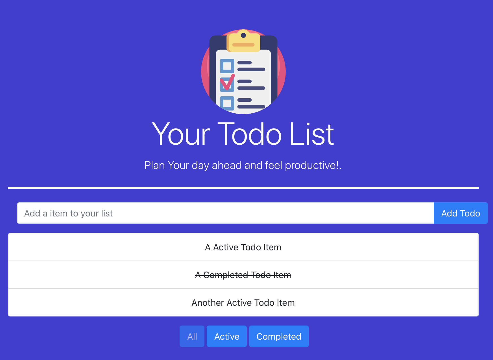

# React/Redux Todo List
A Simple todo list app (Yawn! I know), But one that takes advantage of Redux which makes accessing state between components significantly easier as it avoids passing props up and down. 
Clicking on a todo sets the indevidual item state to complete. 
This enables the ability to filter items by their completed state.

## How to run:
* Clone the repository and cd into the directory
* Run `npm install` to install the project dependencies
* Run `npm start` and open the project on localhost:3000
* Create some TODO items!

  

    <a href="https://madly-street.surge.sh" target="_blank">
    🌟 Live app here 🌟
    </a>
  

## Screenshot
 

  

